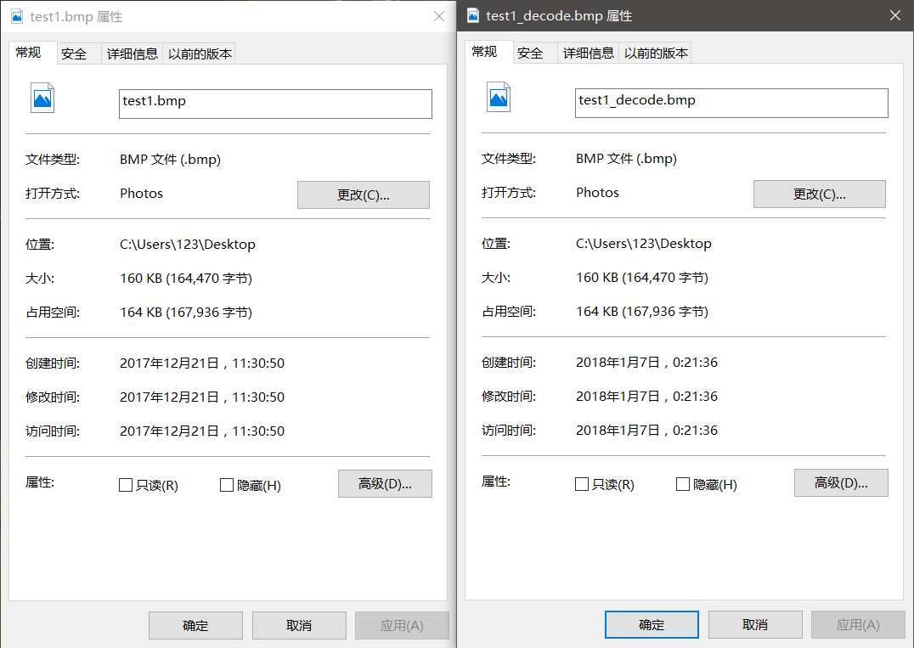

#<center>多媒体技术：图像压缩</center>
###<center>姓名：高俊杰</center>
###<center>学号：15331087</center>


##1、图像有损压缩和无损压缩的背景

最早的计算机中的图像不经过压缩，一张RGB彩色图需要的储存空间字节数至少会和图像总的像素数量相同，意味着一张1920*1080分辨率的图像就要求大概2M的存储空间。这也是为什么bmp格式的图像往往占用空间较大，传输成本较高，在网络传输等多数情况下通常不被采用。为了在尽可能不减少图像原有信息的条件下减少图像数据量，图像压缩算法就必须得到应用。

图像无损压缩的算法能做到图像完全不失真，不丢失任何信息地被压缩并恢复出来。若对图像信息要求极高，不希望牺牲任何图像信息，无损压缩就是必选的方法。由于不能在恢复后丢失信息，压缩率通常不会很高，压缩后的文件和原图像文件的大小一般不会相差数量级。在网络环境下，无损压缩的压缩率还达不到低数据率的要求。

而实际应用中，由于我们发现，图像的用户，也就是人，不具备对图像所有细节的区分能力，对一些频率成分不具有敏感性，有一部分的图像信息不能被人眼观察到，但又会占用可见的数据率，故可以考虑将这类信息从原图像中消除，以换得更高的压缩率。而如果用户对图像质量不作过多要求，甚至可以增加压缩的力度，以更多的图像细节换取更高的压缩率，不过这样的话图像质量的下降就会被明显地观测到。

##2、回顾3种无损压缩和3种有损压缩方法

###简单介绍3种无损压缩方法：

算术编码：统计字符的出现频率，在0到1的区间内按频率的比重依次给各个频率划分区间。对第一个字符，找到对应字符的区间的上下界，在此区间内再按率的比重依次给各个频率划分区间。对第二个字符也是如此，循环往复，直至最后一个字符也按这样处理完。这样就得到了最终的上下界。只要求得一个在此上下界内的二进制小数，那么该二进制小数就是编码值。

参考论文
>算术编码算法及其应用

LZW编码：这个算法主要是不断地更新字符串和编码值的映射表。在已有初始的映射关系下，读入字符并转为编码值，并且将该字符和后一位字符组成的串也加入映射表中并分配映射值。

参考论文
>Huffman编码和LZW编码的改进

Huffman编码：熵编码的鼻祖，对一般的图像无损压缩能有较小的压缩率，将在下文中具体分析，在此不赘言。

参考论文
>几种图像无损压缩与编码方法的比较研究

###简单介绍3种有损压缩方法：

预测编码：例如DPCM，编码的不是直接的数据，而量化后的预测值和原数据值的差。因为差的值往往比原数据值要小，故占用的位数少，可以节省空间。

参考论文
>基于预测编码与DCT变换编码的比较

变换编码：例如DCT和小波变换，变换后可以方便地削减高频部分的信息量。具体下文还将提到，在此不赘言。

参考论文
>压缩编码在图像处理中的应用

矢量编码：把输入数据分组量化编码，即将这些数看成一个k维矢量，然后以矢量为单位逐个矢量进行量化。

参考论文
>图像压缩编码技术研究

##3、重点介绍无损压缩Huffman编码和有损压缩JPEG

###无损压缩Huffman编码原理和步骤：

Huffman编码原理：首先，因为一张原始bmp图像的每个像素都会占用定长的空间来存放像素值，例如灰度图里不论是只出现一次的像素值还是出现了大部分次数的像素值都会每个像素占用一个字节，除非图像的灰度非常均匀，每张bmp图像都会浪费一些字节里的位给了出现次数少的灰度。

因此，定长编码的劣势我们可以用变长编码来挽回。我们可以将较短的位长赋给出现次数较多的灰度值，因为图像里会多次用到这个灰度值，而把较长的的位长赋给出现次数较少的灰度值，因为图像里会较少地用到这个灰度值。假设一张图像里半数的像素上的值相同，那么只用一位来表示这个值会比用八位来表示这个值省下可观的数据量。

这里主要谈一下下面我实现huffman编码的步骤：

（1）统计图像中所有的像素值出现的次数或频率，将像素值按频率从小到大排序建成一张表，

（2）每次选出出现频率最小的两个像素值，以它们中较大者为左叶节点，较小者为右叶节点，他们出现的频率的和作为根节点建一棵子树，从原先的表中删除两个叶节点，加入这个根节点，

（3）循环往复，直至表中的节点被删除至最后一个。至此，由像素值构成的从根节点到最深层的叶节点的树以按出现频率的大小建成。

（4）从根节点开始，给左子节点分配编码值0，右子节点分配编码值1。每个节点分配到的编码值会让它的子节点继承，并给左子节点分配编码值0，右子节点分配编码值1。这样递归下去，出现最多的像素值会分得编码值0，出现最少的像素值会分得编码值111...111，至此，分配编码位的工作完成，像素值以及对应的编码值应该作为一张表被保存下来。

（5）遍历图像的所有像素，每个像素上的值按上表分配编码值后串接在一起，直至所有像素的值都被串接，串接后的数据按比特位储存在一个新的文件中作为压缩后的文件，这样，图像矩阵的huffman压缩编码就完成了。

（6）实际应用中，bmp图像的文件头部和位图头部等信息需要另外保存，用来加在解码恢复出来的图像矩阵的前面，使它成为bmp格式的图像文件。

（7）解码过程中，读取压缩文件中的比特位，参照（4）中编码的映射表，识别出是编码值的比特位串，转换成对应的像素值并填入新的图像矩阵中，编码无误时，编码串解析完毕时新的图像矩阵也就全部恢复出来了。

（8）新的图像再加上（6）中保存的图像头部信息就成为了原汁原味丝毫无损的的恢复图像了。


###有损压缩JPEG的原理和步骤

（1）将RGB类型的图像转成YIQ类型。

（2）因为图像中，低频成分远比高频重要，而削减高频成分会大大提高压缩率，故应将高频部分从低频中提取出来，这可以通过离散余弦变换来做到。将图像分成若干个8*8的块，对所有块进行DCT变换，使得块左上角到右下角的值逐渐减小。

（3）低频部分集中在左上角，高频则在右下角，那么右下角的信息可以被更多地平滑以节省数据量。对DCT后的块按给定的表进行量化，使得块右下角大部分变为0，只有小部分非0值集中在左上角。这一步削减了很多数据量，JPEG压缩的信息损失基本上就集中在了这里。

（4）经过上述处理后的图像矩阵，右下角已经少了很多非0值了，这时要是能若0值尽可能多地串接在一起编码，就能大大地提高压缩率。那么将每个经过上述处理的8*8的块按Z字编排取出，变成1*64的向量，就会使0元素尽可能多连在一起。

（5）将所有转换来的向量的DC分量（即每个向量的第0个元素）一起做差分脉冲调制编码（DPCM），因为它们代表块的平均亮度，亮度值一般较大，不适合与块内其它接近0的AC分量一起编码，但相邻块的平均亮度之间不会相差太多，适合一起做差分编码。

（6）对每个块剩余的63个AC分量，以数字对（连续0的个数，下一个非0数）作为编码数据，直到后面全是0而以特殊数字对（0，0）结尾。

（7）为了进一步提高压缩率，还可以对上述压缩后的数据再用熵编码，例如huffman压缩编码，对上述内容再进行一次无损压缩。

##4、实现基于Huffman编码的图像压缩

实现大体思路遵循上述的原理，关于比特位的处理，如果直接用位运算的话，编写起来较复杂。于是我改用0和1的字符串来逐位表示一个个比特。也就是说，编码过程中经过像素值转成，再由字符串转成比特位，解码过程中经过比特位转成字符串，再由字符串转成像素值。通过字符串作为桥梁，可以避免复杂的位运算，而运行效率也不会下降多少。而至于像素值和字符串怎样转换，还要用到现成的bitset<32>类型。

###c++代码如下：

####HuffmanEncode.cpp:

HuffmanEncode函数对外使用。调用函数HuffmanEncode，输入图像的二维矩阵，图像的宽高，以及另存的压缩后的文件名，执行后得到压缩后的文件以及头部信息文件。

在HuffmanEncode函数内，findMinNode函数用于找到当前最少出现的节点；buildTree函数用于构建哈夫曼树；每个节点的下标为像素值，存有出现次数，指向左右子节点的下标，以及用来判断是否已删除的位；buildTable函数用于建立像素值和编码值的映射关系。


```cpp
#include <stdio.h>
#include <stdlib.h>
#include <string.h>
#include <string>
#include <bitset>

using namespace std;

struct Node {
    int count;
    int left;
    int right;
    int removed;
};

int findMinNode(Node* nodes, int length) {
    int index = -1;
    for (int i = 0; i < length; i++) {
        if ((index == -1 || nodes[i].count < nodes[index].count) && !nodes[i].removed && nodes[i].count > 0) {
            index = i;
        }
    }
    if (index != -1) {
        nodes[index].removed = 1;
    }
    return index;
}

int buildTree(Node* nodes, int* counts) {
    for (int i = 0; i < 256; i++) {
        nodes[i].left = -1;
        nodes[i].right = -1;
        nodes[i].count = counts[i];
        nodes[i].removed = 0;
    }
    int length = 256;

    while (1) {
        int l = findMinNode(nodes, length);
        if (l == -1) {
            break;
        }
        int r = findMinNode(nodes, length);
        if (r == -1) {
            break;
        }
        nodes[length].left = l;
        nodes[length].right = r;
        nodes[length].count = nodes[l].count + nodes[r].count;
        nodes[length].removed = 0;
        length++;
    }
    return length;
}

void buildTable(Node* nodes, int pos, string bits, string * table) {
    int l = nodes[pos].left;
    int r = nodes[pos].right;
    if (nodes[pos].left == -1 && nodes[pos].right == -1) {
        table[pos] = bits;
        return;
    }
    buildTable(nodes, r, bits + "1", table);
    buildTable(nodes, l, bits + "0", table);
}

void HuffmanEncode(unsigned char ** data, int height, int width, const char *writepath) {
    FILE* fp;
    int counts[256];
    memset(counts, 0, sizeof(int) * 256);
    for (int i = 0; i < height; i++) {
        for (int j = 0; j < width; j++) {
            counts[data[i][j]]++;
        }
    }

    Node nodes[256 * 2];
    int length = buildTree(nodes, counts);

    string table[256];
    buildTable(nodes, length - 1, "", table);
    string table_path = "";
    table_path = table_path + writepath + "_table";
    fp = fopen(table_path.c_str(), "w");
    for (int i = 0; i < 256; i++) {
        if (table[i].size() == 0) {
            fprintf(fp, "2\n");
        } else  {
            fprintf(fp, "%s\n", table[i].c_str());
        }
    }
    fclose(fp);

    int total_bit_length = 0;
    for (int i = 0; i < 256; i++) {
        total_bit_length += counts[i] * table[i].size();
    }
    char * str = new char[total_bit_length];
    int cur = 0;
    for (int i = 0; i < height; i++) {
        for (int j = 0; j < width; j++) {
            for (int k = 0; k < table[data[i][j]].size(); k++) {
                str[cur] = table[data[i][j]][k];
                cur++;
            }
            
        }
    }

    fp = fopen(writepath, "wb");
    int times = total_bit_length / 32 + 1;
    string total = "";
    total = total + str;
    for (int i = 0; i < 32 * times - total_bit_length; i++) {
        total = total + "0";
    }
    fwrite(&total_bit_length, sizeof(int), 1, fp);
    for (int i = 0; i < times; i++) {
        bitset<32> byte(total.substr(32 * i, 32));
        
        unsigned long tmp = byte.to_ulong();
        fwrite(&tmp, sizeof(int), 1, fp);
    }
    fclose(fp);
}
```


函数HuffmanDecode直接调用，传入字符类型的数组指针作为解码后数据用于返回到主函数，图像的宽高以及编码文件的路径名。

decodeString函数用于解析由比特位转成的字符串，并将之解析为最终用于返回的解码图像矩阵。其中，传入的map类型参数是读取编码映射表后建立的编码值和像素值的解码映射表，map类型可以极大地减少查表的时间，降低时间复杂度。由于编码值的前缀唯一不会是其它的编码值，所以不会出现错误识别编码字符串的情况。

####HuffmanDecode.cpp:
```cpp
#include <stdio.h>
#include <stdlib.h>
#include <string>
#include <bitset>
#include <map>

using namespace std;

void decodeString(string & total, map<string, int> & table_map, int total_bit_length, unsigned char * data) {
    int index = 0;
    int cur = 1;
    int head = 0;
    while (head < total_bit_length) {
        if (total[head] != '1' && total[head] != '0') {
            head++;
            cur = head + 1;
            continue;
        }
        if (table_map.count(total.substr(head, cur - head))) {
            data[index++] = table_map[total.substr(head, cur - head)];
            head = cur;
            cur = head + 1;
        } else {
            cur++;
        }
    }
}

void HuffmanDecode(unsigned char * decoded_data, int height, int width, const char *readpath) {
    FILE* fp;
    string table[256];
    string path = "";
    path = path + readpath + "_table";
    fp = fopen(path.c_str(), "rb");
    for (int i = 0; i < 256; i++) {
        char tmp[30];
        fscanf(fp, "%s", tmp);
        table[i] = table[i] + tmp;
    }
    fclose(fp);

    map<string, int> table_map;
    for (int i = 0; i < 256; i++) {
        table_map[table[i]] = i;
    }

    fp = fopen(readpath, "rb");
    int total_bit_length;
    fread(&total_bit_length, sizeof(int), 1, fp);
    int times = total_bit_length / 32 + 1;
    string total = "";
    char * str = new char[total_bit_length];
    int *words = new int[times];
    fread(words, sizeof(int), times, fp);
    int cur = 0;
    for (int i = 0; i < times; i++) {
        bitset<32> bits(words[i]);
        string tmp = bits.to_string();
        for (int j = 0; j < 32; j++) {
            str[cur] = tmp[j];
            cur++;
        }
    }
    fclose(fp);
    
    total = total + str;
    decodeString(total, table_map, total_bit_length, decoded_data);
}
```

这个文件装的是主函数，以及主函数调用的关于压缩文件文件、头部信息文件和映射表文件等的读写处理的函数。

####HuffmanMain.cpp
```cpp
#include <windows.h>
#include <stdio.h>
#include <stdlib.h>
#include <string>
#include "HuffmanEncode.cpp"
#include "HuffmanDecode.cpp"

using namespace std;

struct ImageHeader {
    BITMAPFILEHEADER bf;    
    BITMAPINFOHEADER bi;
    int rgb[256];
};

int ReadImage(string path, ImageHeader & ih, unsigned char ** & data) {
    FILE * fp;
    fp = fopen(path.c_str(), "rb");
    if (fp == NULL) {
        return 0;
    } 
    
    fread(&ih.bf, sizeof(BITMAPFILEHEADER), 1, fp);
    fread(&ih.bi, sizeof(BITMAPINFOHEADER), 1, fp);
    fread(&ih.rgb, sizeof(int), 256, fp);
    
    if (ih.bi.biBitCount != 8) {
        printf("Gray image only!\n");
        return 0;
    }
    
    data = new unsigned char*[ih.bi.biHeight];
    int row_width = ih.bi.biWidth + (4 - ih.bi.biWidth % 4);
    for (int i = 0; i < ih.bi.biHeight; i++) {
        data[i] = new unsigned char[ih.bi.biWidth];
    }
    for (int i = ih.bi.biHeight - 1; i >= 0; i--) {
        for (int j = 0; j < ih.bi.biWidth; j++) {
            fread(&data[i][j], 1, 1, fp);
        }
        if (ih.bi.biWidth % 4 > 0) {
            fseek(fp, 4 - ih.bi.biWidth % 4, SEEK_CUR);
        }
    }
    fclose(fp);
    return 1;
}

int CopyHeader(string path, ImageHeader & ih) {
    FILE * fp;
    fp = fopen(path.c_str(), "wb");
    if (fp == NULL) {
        return 0;
    }
    fwrite(&ih.bf, sizeof(BITMAPFILEHEADER), 1, fp);
    fwrite(&ih.bi, sizeof(BITMAPINFOHEADER), 1, fp);
    fwrite(&ih.rgb, sizeof(int), 256, fp);
    fclose(fp);
    return 1;
}

int ReaderHeader(string path, ImageHeader & ih2) {
    FILE * fp;
    fp = fopen(path.c_str(), "rb");
    if (fp == NULL) {
        return 0;
    }
    fread(&ih2.bf, sizeof(BITMAPFILEHEADER), 1, fp);
    fread(&ih2.bi, sizeof(BITMAPINFOHEADER), 1, fp);
    fread(&ih2.rgb, sizeof(int), 256, fp);
    fclose(fp);
    return 1;
}

int WriteImage(string path, ImageHeader & ih2, unsigned char * & decoded_data) {
    FILE * fp;
    fp = fopen(path.c_str(), "wb");
    if (fp == NULL) {
        return 0;
    }
    fwrite(&ih2.bf, sizeof(BITMAPFILEHEADER), 1, fp);
    fwrite(&ih2.bi, sizeof(BITMAPINFOHEADER), 1, fp);
    fwrite(&ih2.rgb, sizeof(int), 256, fp);
    for (int i = ih2.bi.biHeight - 1; i >= 0; i--) {
        fwrite(&decoded_data[i * ih2.bi.biWidth], ih2.bi.biWidth, 1, fp);
        char tmp = 0;
        if (ih2.bi.biWidth % 4 > 0) {
            fwrite(&tmp, 1, 4 - ih2.bi.biWidth % 4, fp);
        }
    }
    fclose(fp);
    return 1;
}

int main() {
    char readpath[50];
    printf("BMP format image name:");
    scanf("%s", readpath);
    ImageHeader ih;
    unsigned char ** data;

    string path = "";
    path = path + readpath + ".bmp";
    if (ReadImage(path, ih, data)) {
        printf("Image %s read successful.\n", readpath);
    } else {
        printf("Image %s reading failed.\n", readpath);
        return 0;
    }

    path = "";
    path = path + readpath + "_head";
    if (CopyHeader(path, ih)) {
        printf("Header file copied.\n");
    } else {
        printf("Header file copying failed.\n");
        return 0;
    }
    
    path = "";
    path = path + readpath;
    HuffmanEncode(data, ih.bi.biHeight, ih.bi.biWidth, path.c_str());
    printf("Image encoded.\n");
    
    path = "";
    path = path + readpath + "_head";
    ImageHeader ih2;
    if (ReaderHeader(path, ih2)) {
        printf("Header file read successful.\n");
    } else {
        printf("Header file reading failed.\n");
        return 0;
    }
    
    path = "";
    path = path + readpath;
    unsigned char * decoded_data = new unsigned char[ih2.bi.biHeight * ih2.bi.biWidth];
    HuffmanDecode(decoded_data, ih2.bi.biHeight, ih2.bi.biWidth, path.c_str());
    printf("Image decoded.\n");
    
    path = "";
    path = path + readpath + "_decode.bmp";
    if (WriteImage(path, ih2, decoded_data)) {
        printf("Decoded image saved successful.\n");
    } else {
        printf("Decoded image saving failed.\n");
        return 0;
    }
}
```

##5、实验结果

原图像test.bmp：


处理过程：


原图像文件test.bmp与压缩后文件test的大小对比：


压缩率约为15.27%。

解码后的图像test_decode.bmp:


原图像文件test.bmp与解码后图像test_decode.bmp的大小对比：


可以看到，解码后图像能一个字节都不差地被恢复出来。因为是无损压缩，失真率为0。

另再测试原图像test1.bmp：


处理过程：


原图像文件test1.bmp与压缩后文件test1的大小对比：


压缩率约为6.19%。

解码后的图像test1_decode.bmp:


原图像文件test1.bmp与解码后图像test1_decode.bmp的大小对比：



可以看到，解码后图像还是能一个字节都不差地被恢复出来。因为是无损压缩，失真率为0。


##6、总结

这次作业，一开始我并没打算纯用C/C++来实现Huffman压缩图像，因为原先不清楚bmp格式的文件怎么读取。但Matlab可以调用函数直接获得图像矩阵，这样不不用去处理文件头部信息了。但是对于Matlab很高级的编程工具，要做到Huffman建树、建表，以及按位来写文件的话却并不知道如何着手，反而是用惯了的C/C++更适合这种工作。于是我开始寻求两种优势兼具的解决方法：先用Matlab读取出图像矩阵，再将图像矩阵通过面向C语言的接口传给C代码压缩处理，最后返回解码后的图像矩阵到Matlab，让Matlab封装图像矩阵成bmp格式文件。这样一来，我既能不去考虑图像文件头部处理，又能用C/C++来从底层实现编码压缩和解码。

通过网上查阅资料，我学到了Matlab的C语言接口mex的基本使用，包括如何在Matlab传递参数，如何在C代码内解析参数。解析的过程有点绕，不过熟练掌握指针的知识的话也能正确处理好参数。

这份代码能正确进行Huffman编码和解码，不过最后我还是改用C++重新实现了一次，因为绕了这么久好像也就差个bmp格式文件的读写罢了，干脆再差点关于bmp的资料，把这个问题也用C语言解决了罢。

以上的代码我花了两天时间来编写，测试起来很痛苦，因为用对着图像矩阵检查像素值是否算对，甚至还要用BinaryViewer来检查二进制位是否正确，如果不正确又会是哪里出错了。每晚都要debug知道三四点，那几天感觉严重缺乏睡眠。

但总体来说，这次大作业，我能应用学到的多媒体技术知识来解决问题并温习了学过的知识，虽然过程不轻松，但最终能正确丝毫无误地解码出图像时，成就感还是满满的，结果还是很让自己满意，并且编程也算是能练练手了。

以下是我一开始用这种方法实现的代码：

Matlab脚本Huffman.m:

```matlab
img = imread('test.bmp');
%img = rgb2gray(img);
[height, width] = size(img);

mex HuffmanEncode.cpp
HuffmanEncode(int32(img), 'test.txt');

mex HuffmanDecode.cpp
mat = uint8(HuffmanDecode('test.txt', height, width));
imwrite(mat, 'test_decoded.bmp', 'bmp');

```


HuffmanEncode.cpp:

```cpp
#include "mex.h"
#include <string.h>
#include <stdlib.h>
#include <stdio.h>
#include <string>
#include <bitset>

using namespace std;

struct Node {
    int count;
    int left;
    int right;
    int removed;
};

int findMinNode(Node* nodes, int length) {
    int index = -1;
    for (int i = 0; i < length; i++) {
        if ((index == -1 || nodes[i].count < nodes[index].count) && !nodes[i].removed && nodes[i].count > 0) {
            index = i;
        }
    }
    if (index != -1) {
        nodes[index].removed = 1;
    }
    return index;
}

int buildTree(Node* nodes, int* counts) {
    for (int i = 0; i < 256; i++) {
        nodes[i].left = -1;
        nodes[i].right = -1;
        nodes[i].count = counts[i];
        nodes[i].removed = 0;
    }
    int length = 256;

    while (1) {
        int l = findMinNode(nodes, length);
        if (l == -1) {
            break;
        }
        int r = findMinNode(nodes, length);
        if (r == -1) {
            break;
        }
        nodes[length].left = l;
        nodes[length].right = r;
        nodes[length].count = nodes[l].count + nodes[r].count;
        nodes[length].removed = 0;
        length++;
    }
    return length;
}

void buildTable(Node* nodes, int pos, string bits, string * table) {
    int l = nodes[pos].left;
    int r = nodes[pos].right;
    if (nodes[pos].left == -1 && nodes[pos].right == -1) {
        table[pos] = bits;
        return;
    }
    buildTable(nodes, r, bits + "1", table);
    buildTable(nodes, l, bits + "0", table);
}

void mexFunction(int nlhs, mxArray *plhs[], int nrhs, const mxArray *prhs[]) {
    double* dataCursor = mxGetPr(prhs[0]);
    int height = mxGetM(prhs[0]);
    int width = mxGetN(prhs[0]);
    char *writepath = mxArrayToString(prhs[1]);
    FILE* fp;
    int * data = (int *)dataCursor;
    int counts[256];
    memset(counts, 0, sizeof(int) * 256);
    for (int i = 0; i < height; i++) {
        for (int j = 0; j < width; j++) {
            counts[data[i + height * j]]++;
        }
    }

    Node nodes[256 * 2];
    int length = buildTree(nodes, counts);

    string table[256];
    buildTable(nodes, length - 1, "", table);
    string table_path = "table_of_";
    table_path = table_path + writepath;
    fp = fopen(table_path.c_str(), "w");
    for (int i = 0; i < 256; i++) {
        if (table[i].size() == 0) {
            fprintf(fp, "2\n");
        } else  {
            fprintf(fp, "%s\n", table[i].c_str());
        }
    }
    fclose(fp);

    int total_bit_length = 0;
    for (int i = 0; i < 256; i++) {
        total_bit_length += counts[i] * table[i].size();
    }
    char * str = new char[total_bit_length];
    int cur = 0;
    for (int i = 0; i < width; i++) {
        for (int j = 0; j < height; j++) {
            for (int k = 0; k < table[data[height * i + j]].size(); k++) {
                str[cur] = table[data[height * i + j]][k];
                cur++;
            }
            
        }
    }

    fp = fopen(writepath, "wb");
    int times = total_bit_length / 32 + 1;
    string total = "";
    total = total + str;
    for (int i = 0; i < 32 * times - total_bit_length; i++) {
        total = total + "0";
    }
    fwrite(&total_bit_length, sizeof(int), 1, fp);
    for (int i = 0; i < times; i++) {
        bitset<32> byte(total.substr(32 * i, 32));
        
        unsigned long tmp = byte.to_ulong();
        fwrite(&tmp, sizeof(int), 1, fp);
    }
    fclose(fp);
}
```

HuffmanDecode.cpp:

```cpp
#include "mex.h"
#include <stdlib.h>
#include <stdio.h>
#include <string>
#include <bitset>
#include <map>

using namespace std;

void decodeString(string & total, map<string, int> & table_map, int total_bit_length, double* res) {
    int index = 0;
    int cur = 1;
    int head = 0;
    while (head < total_bit_length) {
        if (total[head] != '1' && total[head] != '0') {
            head++;
            cur = head + 1;
            continue;
        }
        if (table_map.count(total.substr(head, cur - head))) {
            res[index++] = table_map[total.substr(head, cur - head)];
            head = cur;
            cur = head + 1;
        } else {
            cur++;
        }
    }
}

void mexFunction(int nlhs, mxArray *plhs[], int nrhs, const mxArray *prhs[]) {
    const char *readpath = mxArrayToString(prhs[0]);

    int height = mxGetScalar(prhs[1]);
    int width = mxGetScalar(prhs[2]);
    FILE* fp;
    string table[256];
    string table_path = "table_of_";
    table_path = table_path + readpath;
    fp = fopen(table_path.c_str(), "rb");
    for (int i = 0; i < 256; i++) {
        char tmp[30];
        fscanf(fp, "%s", tmp);
        table[i] = table[i] + tmp;
    }
    fclose(fp);

    map<string, int> table_map;
    for (int i = 0; i < 256; i++) {
        table_map[table[i]] = i;
    }

    fp = fopen(readpath, "rb");
    int buffer;
    int total_bit_length;
    fread(&total_bit_length, sizeof(int), 1, fp);

    int times = total_bit_length / 32 + 1;
    string total = "";
    char * str = new char[total_bit_length];
    int *words = new int[times];
    fread(words, sizeof(int), times, fp);
    int cur = 0;
    for (int i = 0; i < times; i++) {
        bitset<32> bits(words[i]);
        string tmp = bits.to_string();
        for (int j = 0; j < 32; j++) {
            str[cur] = tmp[j];
            cur++;
        }
    }
    fclose(fp);
    total = total + str;
    double *res;
    plhs[0] = mxCreateDoubleMatrix(height, width, mxREAL);
    res = mxGetPr(plhs[0]);
    decodeString(total, table_map, total_bit_length, res);
}  
```
